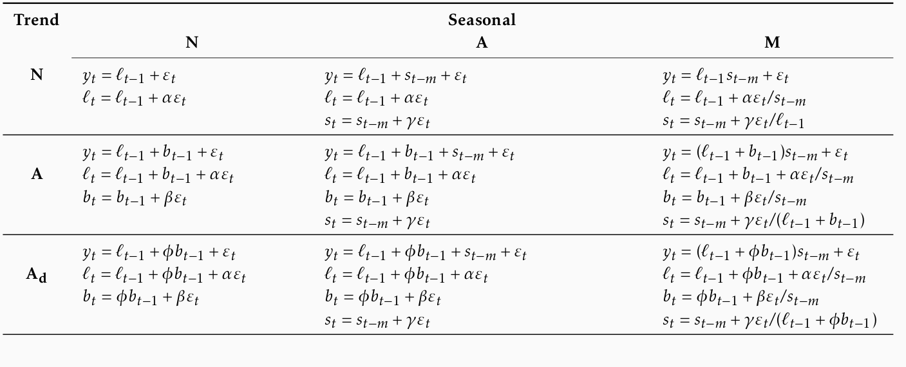
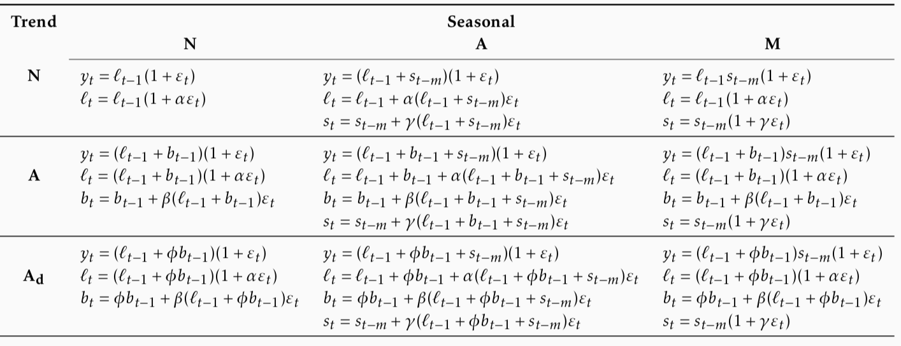

# Exponential Smoothing 

```{r setup3, include=FALSE}
knitr::opts_chunk$set(echo = FALSE, cache=TRUE, warning=FALSE, message=FALSE)
options(digits=4, width=60)
library(fpp3)
library(patchwork)
library(purrr)
library(tidyverse)

```

\pagenumbering{arabic}
## Introduction

### Historical perspective

 * Developed in the 1950s and 1960s as methods (algorithms) to produce point forecasts.
 * Combine a "level", "trend" (slope) and "seasonal" component to describe a time series.
 * The rate of change of the components are controlled by "smoothing parameters": $\alpha$, $\beta$ and $\gamma$ respectively.
  * Need to choose best values for the smoothing parameters (and initial states).
  * Equivalent ETS state space models developed in the 1990s and 2000s.


### Big idea: control the rate of change

$\alpha$ controls the flexibility of the **level**

* If $\alpha = 0$, the level never updates (mean)
* If $\alpha = 1$, the level updates completely (naive)

$\beta$ controls the flexibility of the **trend**

* If $\beta = 0$, the trend is linear (regression trend)
* If $\beta = 1$, the trend updates every observation

$\gamma$ controls the flexibility of the **seasonality**

* If $\gamma = 0$, the seasonality is fixed (seasonal means)
* If $\gamma = 1$, the seasonality updates completely (seasonal naive)

### A model for levels, trends, and seasonalities

We want a model that captures the level ($\ell_t$), trend ($b_t$) and seasonality ($s_t$).

**How do we combine these elements?**

- Additively?

$$y_t = \ell_{t-1} + b_{t-1} + s_{t-m} + \varepsilon_t$$

- Multiplicatively?

$$y_t = \ell_{t-1}b_{t-1}s_{t-m}(1 + \varepsilon_t)$$

- Perhaps a mix of both?

$$y_t = (\ell_{t-1} + b_{t-1}) s_{t-m} + \varepsilon_t$$

**How do the level, trend and seasonal components evolve over time?**

General notation:

$$\text{ETS: } \textbf{E}\text{xponen}\textbf{T}\text{ial}\textbf{ S}\text{moothing}$$


**E**rror: Additive (`"A"`) or multiplicative (`"M"`)

**T**rend: None (`"N"`), additive (`"A"`), multiplicative (`"M"`), or damped (`"Ad"` or `"Md"`).

**S**easonality: None (`"N"`), additive (`"A"`) or multiplicative (`"M"`)

## Simple exponential smoothing

Time series $y_1,y_2,\dots,y_T$.

**Random walk forecasts**
$$\hat{y}_{T+h|T} = y_T$$

**Average forecasts**

$$\hat{y}_{T+h|T} = \frac1T\sum_{t=1}^T y_t$$


* Want something in between these methods.
* Most recent data should have more weight.

<!-- * Simple exponential smoothing uses a weighted moving average with weights that decrease exponentially. -->

**Forecast equation**

$$\hat{y}_{T+1|T} = \alpha y_T + \alpha(1-\alpha) y_{T-1} + \alpha(1-\alpha)^2 y_{T-2}+ \cdots$$

where $0 \le \alpha \le1$

\small\begin{tabular}{lllll}
\toprule
& \multicolumn{4}{l}{Weights assigned to observations for:}\\
Observation  &   $\alpha = 0.2$   &   $\alpha = 0.4$  &   $\alpha = 0.6$  & $\alpha = 0.8$ \\
\midrule
$y_{T}$      & 0.2         & 0.4          & 0.6         & 0.8\\
$y_{T-1}$    & 0.16        & 0.24         & 0.24        & 0.16\\
$y_{T-2}$    & 0.128       & 0.144        & 0.096       & 0.032\\
$y_{T-3}$    & 0.1024      & 0.0864       & 0.0384      & 0.0064\\
$y_{T-4}$    & $(0.2)(0.8)^4$  & $(0.4)(0.6)^4$   & $(0.6)(0.4)^4$  & $(0.8)(0.2)^4$\\
$y_{T-5}$    & $(0.2)(0.8)^5$  & $(0.4)(0.6)^5$   & $(0.6)(0.4)^5$  & $(0.8)(0.2)^5$\\
\bottomrule
\end{tabular}

<!-- animation-->

**Component form**

- Forecast equation $\hat{y}_{t+h|t} = \ell_{t}$

- Smoothing equation $\ell_{t} = \alpha y_{t} + (1 - \alpha)\ell_{t-1}$

* $\ell_t$ is the level (or the smoothed value) of the series at time t.
* $\hat{y}_{t+1|t} = \alpha y_t + (1-\alpha) \hat{y}_{t|t-1}$\newline
Iterate to get exponentially weighted moving average form.
  
**Weighted average form**

$$\hat{y}_{T+1|T}=\sum_{j=0}^{T-1} \alpha(1-\alpha)^j y_{T-j}+(1-\alpha)^T \ell_{0}$$

### Optimising smoothing parameters

* Need to choose best values for $\alpha$ and $\ell_0$.
  * Similarly to regression, choose optimal parameters by minimising SSE:
  
$$\text{SSE}=\sum_{t=1}^T(y_t-\hat{y}_{t|t-1})^2.$$

  * Unlike regression there is no closed form solution --- use numerical optimization.
 
```{r ses, echo=FALSE}
algeria_economy <- global_economy %>%
  filter(Country == "Algeria")
fit <- algeria_economy %>%
  model(
    ETS(Exports ~ error("A") + trend("N") + season("N"))
  )
``` 

 * For Algerian Exports example:
    - $\hat\alpha = `r sprintf("%4.4f",tidy(fit)[1,4])`$
    - $\hat\ell_0 = `r sprintf("%4.2f",tidy(fit)[2,4])`$
    
    ```{r alpha-static, fig.height=5, fig.width=8}
alpha_static <- map_dfr(list(0, as.numeric(tidy(fit)[1,4]), 1), function(alpha){
  fit <- algeria_economy %>%
    model(ETS(Exports ~ error("A") + trend("N", alpha = alpha, alpha_range = c(-0.01,1),
          beta_range = c(-1,1)) + season("N", gamma_range = c(-1,1)), bounds = "admissible"))
  fit %>%
    augment() %>%
    mutate(alpha = tidy(fit)$estimate[tidy(fit)$term == "alpha"]) %>%
    as_tibble()
}) %>%
  mutate(alpha = factor(format(alpha)))
algeria_economy %>%
  ggplot(aes(x = Year, y = Exports)) +
  geom_line() +
  geom_line(aes(y = .fitted, colour = alpha), data = alpha_static) +
  ylab("Exports (% of GDP)") +
  ggtitle("Algerian exports of goods and services: level")
```


### Models and methods

#### Methods

  * Algorithms that return point forecasts.

#### Models

  * Generate same point forecasts but can also generate forecast distributions.
  * A stochastic (or random) data generating process that can generate an entire forecast distribution.
  * Allow for "proper" model selection.

### ETS(A,N,N): A model for SES
  
**Component form**

- Forecast equation: $\hat{y}_{t+h|t} = \ell_{t}$

- Smoothing equation: $\ell_{t} = \alpha y_{t} + (1 - \alpha)\ell_{t-1}$

Forecast error: $e_t = y_t - \hat{y}_{t|t-1} = y_t - \ell_{t-1}$

**Error correction form**

$$y_t = \ell_{t-1} + e_t$$
$$\ell_{t}= \ell_{t-1}+\alpha( y_{t}-\ell_{t-1})$$

$\ell_{t}=\ell_{t-1}+\alpha e_{t}$

Specify probability distribution for $e_t$, we assume $e_t = \varepsilon_t\sim\text{NID}(0,\sigma^2)$.

### ETS(A,N,N)

- Measurement equation: $y_t = \ell_{t-1} + \varepsilon_t$

- State equation: $\ell_t=\ell_{t-1}+\alpha \varepsilon_t$

where $\varepsilon_t\sim\text{NID}(0,\sigma^2)$.

* "innovations" or "single source of error" because equations have the same error process, $\varepsilon_t$.
  * Measurement equation: relationship between observations and states.
  * State equation(s): evolution of the state(s) through time.
  
### ETS(M,N,N)

SES with multiplicative errors.

* Specify relative errors  $\varepsilon_t=\frac{y_t-\hat{y}_{t|t-1}}{\hat{y}_{t|t-1}}\sim \text{NID}(0,\sigma^2)$
  * Substituting $\hat{y}_{t|t-1}=\ell_{t-1}$ gives:
    * $y_t = \ell_{t-1}+\ell_{t-1}\varepsilon_t$
    * $e_t = y_t - \hat{y}_{t|t-1} = \ell_{t-1}\varepsilon_t$
    
- Measurement equation: $y_t = \ell_{t-1}(1 + \varepsilon_t)$
- State equation: $\ell_t=\ell_{t-1}(1+\alpha \varepsilon_t)$

* Models with additive and multiplicative errors with the same parameters generate the same point forecasts but different prediction intervals.

### ETS(A,N,N): Specifying the model

```{r ann-spec, echo = TRUE, results = "hide"}
ETS(y ~ error("A") + trend("N") + season("N"))
```

By default, an optimal value for $\alpha$ and $\ell_0$ is used.

$\alpha$ can be chosen manually in `trend()`.

```{r alpha-spec, echo = TRUE, eval = FALSE}
trend("N", alpha = 0.5)
trend("N", alpha_range = c(0.2, 0.8))
```

### Example: Algerian Exports

```{r ses-fit, echo=TRUE, cache=TRUE}
algeria_economy <- global_economy %>%
  filter(Country == "Algeria")
fit <- algeria_economy %>%
  model(ANN = ETS(Exports ~ error("A") + trend("N") + season("N")))
report(fit)
```

```{r ses-cmp0, echo = TRUE}
components(fit) %>% autoplot()
```

```{r ses-cmp, echo = TRUE}
components(fit) %>%
  left_join(fitted(fit), by = c("Country", ".model", "Year"))
```

```{r ses-fc, echo=TRUE, cache=TRUE}
fit %>%
  forecast(h = 5) %>%
  autoplot(algeria_economy) +
  ylab("Exports (% of GDP)") + xlab("Year")
```

\newpage

## Models with trend

### Holt's linear trend

**Component form**

- Forecast  $\hat{y}_{t+h|t} = \ell_{t} + hb_{t}$ 
- Level $\ell_{t} = \alpha y_{t} + (1 - \alpha)(\ell_{t-1} + b_{t-1})$
- Trend $b_{t} = \beta^*(\ell_{t} - \ell_{t-1}) + (1 -\beta^*)b_{t-1}$

* Two smoothing parameters $\alpha$ and $\beta^*$ ($0\le\alpha,\beta^*\le1$).
  * $\ell_t$ level: weighted average between $y_t$ and one-step ahead forecast for time $t$, $(\ell_{t-1} + b_{t-1}=\hat{y}_{t|t-1})$
  * $b_t$ slope: weighted average of $(\ell_{t} - \ell_{t-1})$ and $b_{t-1}$, current and previous estimate of slope.
  * Choose $\alpha, \beta^*, \ell_0, b_0$ to minimise SSE.

### ETS(A,A,N)

Holt's linear method with additive errors.

  * Assume $\varepsilon_t=y_t-\ell_{t-1}-b_{t-1} \sim\text{NID}(0,\sigma^2)$.
  * Substituting into the error correction equations for Holt's linear method
  
    $$y_t=\ell_{t-1}+b_{t-1}+\varepsilon_t$$
      $$\ell_t=\ell_{t-1}+b_{t-1}+\alpha \varepsilon_t$$
      $$b_t=b_{t-1}+\alpha\beta^* \varepsilon_t$$
  * For simplicity, set $\beta=\alpha \beta^*$.
  
### Exponential smoothing: trend/slope

```{r beta-anim, cache=TRUE, echo=FALSE, fig.show='animate', interval=1/10, message=FALSE, fig.height=5, fig.width=8, aniopts='controls,buttonsize=0.3cm,width=11.5cm', eval=FALSE}
aus_economy <- global_economy %>%
  filter(Code == "AUS") %>%
  mutate(Pop = Population/1e6)
beta_anim <- map_dfr(set_names(
  seq(0, 0.5, length.out = 100),
  seq(0, 0.5, length.out = 100)),
  function(beta){
    aus_economy %>%
      model(ETS(Pop ~ error("A") +
                  trend("A",
                    alpha = 0.001,
                    alpha_range = c(-1,1),
                    beta = beta,
                    beta_range = c(-1,1)) +
                  season("N",
                    gamma_range = c(-1,1)),
                bounds = "admissible")
      ) %>%
      augment() %>%
      as_tibble()
    }, .id = "beta") %>%
  mutate(beta = 0.005-as.numeric(beta))
beta_anim %>%
  left_join(select(aus_economy, Year), by = "Year") %>%
  ggplot(aes(x = Year, y = Pop)) +
  geom_line() +
  geom_line(aes(y = .fitted), colour = "blue") +
  transition_manual(beta) +
  ylab("Population (millions)") +
  ggtitle("Australian population: trend (beta = {format(0.005-as.numeric(as.character(current_frame)), nsmall=2)})")
```

```{r beta-static, fig.height=5, fig.width=8, eval=FALSE, echo=FALSE}
aus_economy <- global_economy %>%
  filter(Code == "AUS") %>%
  mutate(Pop = Population/1e6)
beta_static <- map_dfr(
      list(0, 0.3,0.9),
      function(beta) {
        fit <- aus_economy %>%
          model(ETS(Pop ~ error("A") +
                      trend("A",
                        alpha = 0.00001,
                        alpha_range = c(-.1,1),
                        beta = beta,
                        beta_range = c(0,.99)) +
                      season("N",
                        gamma_range = c(-1,1)),
                    bounds = "admissible")
          )
        fit %>%
          augment() %>%
          mutate(beta = tidy(fit)$estimate[tidy(fit)$term == "beta"]) %>%
          as_tibble()
      }
  ) %>%
  mutate(beta = factor(format(beta))) %>%
  left_join(select(aus_economy, Year), by = "Year")
aus_economy %>%
  ggplot(aes(x = Year, y = Pop)) +
  geom_line() +
  geom_line(aes(y = .fitted, colour = beta), data = beta_static) +
  ylab("Population (millions)") +
  ggtitle("Australian population")
```

```{r beta-static1, fig.height=5, fig.width=8, echo=FALSE}
beta <- 0
global_economy %>%
  filter(Code == "AUS") %>%
  mutate(Pop = Population/1e6) %>%
  model(ETS(Pop ~ error("A") +
                   trend("A",
                         alpha = 0.0001,
                         beta =beta),
             bounds = "admissible")
          ) %>%
  augment() %>%
  mutate(beta = beta) %>%
  as_tibble() %>%
  ggplot(aes(x = Year, y = Pop)) +
  geom_line() +
  geom_line(aes(y = .fitted), colour = "blue") +
  ylab("Population (millions)") +
  ggtitle(paste("Australian population. beta =", beta))
```

```{r beta-static2, fig.height=5, fig.width=8, echo=FALSE}
beta <- 0.15
global_economy %>%
  filter(Code == "AUS") %>%
  mutate(Pop = Population/1e6) %>%
  model(ETS(Pop ~ error("A") +
                   trend("A",
                         alpha = 0.0001,
                         beta =beta),
             bounds = "admissible")
          ) %>%
  augment() %>%
  mutate(beta = beta) %>%
  as_tibble() %>%
  ggplot(aes(x = Year, y = Pop)) +
  geom_line() +
  geom_line(aes(y = .fitted), colour = "blue") +
  ylab("Population (millions)") +
  ggtitle(paste("Australian population. beta =", beta))
```


```{r beta-static3, fig.height=5, fig.width=8, echo=FALSE}
beta <- 0.8
global_economy %>%
  filter(Code == "AUS") %>%
  mutate(Pop = Population/1e6) %>%
  model(ETS(Pop ~ error("A") +
                   trend("A",
                         alpha = 0.0001,
                         beta =beta),
             bounds = "admissible")
          ) %>%
  augment() %>%
  mutate(beta = beta) %>%
  as_tibble() %>%
  ggplot(aes(x = Year, y = Pop)) +
  geom_line() +
  geom_line(aes(y = .fitted), colour = "blue") +
  ylab("Population (millions)") +
  ggtitle(paste("Australian population. beta =", beta))
```


### ETS(M,A,N)

Holt's linear method with multiplicative errors.

  * Assume $\varepsilon_t=\frac{y_t-(\ell_{t-1}+b_{t-1})}{(\ell_{t-1}+b_{t-1})}$
  * Following a similar approach as above, the innovations state space model underlying Holt's linear method with multiplicative errors is specified as
  
      $$y_t=(\ell_{t-1}+b_{t-1})(1+\varepsilon_t)$$
      $$\ell_t=(\ell_{t-1}+b_{t-1})(1+\alpha \varepsilon_t)$$
      $$b_t=b_{t-1}+\beta(\ell_{t-1}+b_{t-1}) \varepsilon_t$$

where again  $\beta=\alpha \beta^*$ and $\varepsilon_t \sim \text{NID}(0,\sigma^2)$.

### ETS(A,A,N): Specifying the model


```{r aan-spec, echo = TRUE, results = "hide"}
ETS(y ~ error("A") + trend("A") + season("N"))
```

By default, optimal values for $\beta$ and $b_0$ are used.

$\beta$ can be chosen manually in `trend()`.

```{r beta-spec, echo = TRUE, eval = FALSE}
trend("A", beta = 0.004)
trend("A", beta_range = c(0, 0.1))
```


### Example: Australian population

```{r holt-fit, echo=TRUE}
aus_economy <- global_economy %>% filter(Code == "AUS") %>%
  mutate(Pop = Population/1e6)
fit <- aus_economy %>%
  model(AAN = ETS(Pop ~ error("A") + trend("A") + season("N")))
report(fit)
```

```{r holt-cmp-plot, echo=TRUE, dependson='holt-fit', fig.height=5}
components(fit) %>% autoplot()
```

```{r holt-cmp, echo=TRUE, dependson='holt-fit'}
components(fit) %>%
  left_join(fitted(fit), by = c("Country", ".model", "Year"))
```

```{r holt-fc, echo=TRUE, cache=TRUE, dependson='holt-fit'}
fit %>%
  forecast(h = 10) %>%
  autoplot(aus_economy) +
  ylab("Population") + xlab("Year")
```

### Damped trend method

**Component form**

$$\hat{y}_{t+h|t} = \ell_{t} + (\phi+\phi^2 + \dots + \phi^{h})b_{t}$$
$$\ell_{t} = \alpha y_{t} + (1 - \alpha)(\ell_{t-1} + \phi b_{t-1})$$
$$b_{t} = \beta^*(\ell_{t} - \ell_{t-1}) + (1 -\beta^*)\phi b_{t-1}.$$

  * Damping parameter $0<\phi<1$.
  * If $\phi=1$, identical to Holt's linear trend.
  * As $h\rightarrow\infty$, $\hat{y}_{T+h|T}\rightarrow \ell_T+\phi b_T/(1-\phi)$.
  * Short-run forecasts trended, long-run forecasts constant.

### Example: Australian population

 * Write down the model for ETS(A,$A_d$,N)
 
 ```{r, echo=TRUE, fig.height=3.6}
aus_economy %>%
  model(holt = ETS(Pop ~ error("A") + trend("Ad") + season("N"))) %>%
  forecast(h = 20) %>%
  autoplot(aus_economy)
```

```{r, echo=TRUE}
fit <- aus_economy %>%
  filter(Year <= 2010) %>%
  model(
    ses = ETS(Pop ~ error("A") + trend("N") + season("N")),
    holt = ETS(Pop ~ error("A") + trend("A") + season("N")),
    damped = ETS(Pop ~ error("A") + trend("Ad") + season("N"))
  )
```

```{r, echo = TRUE, results = 'hide'}
tidy(fit)
accuracy(fit)
```


```{r echo=FALSE}
fit_terms <- tidy(fit) %>%
  spread(.model, estimate) %>%
  mutate(term = factor(term, levels = c("alpha", "beta", "phi", "l", "b"), labels = c("alpha", "beta^*", "phi", "l_0", "b_0"))) %>%
  arrange(term)

fit_accuracy <- accuracy(fit) %>%
  bind_rows(
    forecast(fit, h = 9) %>%
      accuracy(aus_economy)
  ) %>%
  gather(term, estimate, -Country, -.model, -.type) %>%
  spread(.model, estimate) %>%
  filter(term == "RMSE" | .type == "Test" & term %in% c("RMSE", "MAE", "MAPE", "MASE")) %>%
  arrange(desc(.type), desc(term)) %>%
  unite("term", .type, term, sep = " ")

bind_rows(fit_terms, fit_accuracy) %>%
  select(term, ses, holt, damped) %>%
  rename(SES = ses, `Linear trend` = holt, `Damped trend` = damped) %>%
  mutate_if(is.numeric, ~ ifelse(is.na(.), "", formatC(., format = "f", 2))) %>%
  knitr::kable(booktabs = TRUE, align='r')
```


## Models with seasonality

### Holt-Winters additive method


Holt and Winters extended Holt's method to capture seasonality.

**Component form**

$$\hat{y}_{t+h|t} = \ell_{t} + hb _{t} + s_{t+h-m(k+1)}$$
$$\ell_{t} = \alpha(y_{t} - s_{t-m}) + (1 - \alpha)(\ell_{t-1} + b_{t-1})$$
$$b_{t} = \beta^*(\ell_{t} - \ell_{t-1}) + (1 - \beta^*)b_{t-1}$$
$$s_{t} = \gamma (y_{t}-\ell_{t-1}-b_{t-1}) + (1-\gamma)s_{t-m}$$

* $k=$ integer part of $(h-1)/m$. Ensures estimates from the final year are used for forecasting.
  * Parameters:&nbsp; $0\le \alpha\le 1$,&nbsp; $0\le \beta^*\le 1$,&nbsp; $0\le \gamma\le 1-\alpha$&nbsp;  and $m=$  period of seasonality (e.g. $m=4$ for quarterly data).


 * Seasonal component is usually expressed as
  
   $$s_{t} = \gamma^* (y_{t}-\ell_{t})+ (1-\gamma^*)s_{t-m}.$$
  * Substitute in for $\ell_t$:
    
    $$s_{t} = \gamma^*(1-\alpha) (y_{t}-\ell_{t-1}-b_{t-1})+ [1-\gamma^*(1-\alpha)]s_{t-m}$$
  * We set $\gamma=\gamma^*(1-\alpha)$.
  * The usual parameter restriction is $0\le\gamma^*\le1$, which translates to $0\le\gamma\le(1-\alpha)$.

```{r gamma-static, fig.height=5, fig.width=8}
j07 <- PBS %>%
  filter(ATC2 == "J07") %>%
  summarise(Cost = sum(Cost))

gamma_static <- map_dfr(list(0, NULL, 1), function(gamma){
  fit <- j07 %>%
    model(ETS(Cost ~ error("A") + trend("N", alpha = 0.001, alpha_range = c(-1,1),
              beta_range = c(-1,1)) + season("A", gamma = gamma, gamma_range = c(-1,1)), bounds = "admissible"))
  fit %>%
    augment() %>%
    mutate(gamma = tidy(fit)$estimate[tidy(fit)$term == "gamma"]) %>%
    as_tibble()
}) %>%
  mutate(gamma = factor(format(gamma)))
j07 %>%
  ggplot(aes(x = Month, y = Cost)) +
  geom_line() +
  geom_line(aes(y = .fitted, colour = gamma), data = gamma_static) +
  ylab("Cost of scripts ($AUD)") +
  ggtitle("Medicare Australia cost of vaccine scripts: seasonality")
```

### ETS(A,A,A)

Holt-Winters additive method with additive errors.

- Forecast equation}  $\hat{y}_{t+h|t} = \ell_{t} + hb_{t} + s_{t+h-m(k+1)}$
- Observation equation}  $y_t=\ell_{t-1}+b_{t-1}+s_{t-m} + \varepsilon_t$
- State equations} $$\ell_t=\ell_{t-1}+b_{t-1}+\alpha \varepsilon_t$$
$$b_t=b_{t-1}+\beta \varepsilon_t$$
$$s_t = s_{t-m} + \gamma\varepsilon_t$$

* Forecast errors: $\varepsilon_{t} = y_t - \hat{y}_{t|t-1}$
* $k$ is integer part of $(h-1)/m$

**Activity**

 * Write down the model for ETS(A,N,A)
 

### Holt-Winters multiplicative method

For when seasonal variations are changing proportional to the level of the series.

**Component form**

$$\hat{y}{t+h}{t} = (\ell_{t} + hb_{t})s_{t+h-m(k+1)}$$
$$\ell_{t} = \alpha \frac{y_{t}}{s_{t-m}} + (1 - \alpha)(\ell_{t-1} + b_{t-1})$$
        b_{t} &= $$\beta^*(\ell_{t}-\ell_{t-1}) + (1 - \beta^*)b_{t-1}$$
      $$s_{t} = \gamma \frac{y_{t}}{(\ell_{t-1} + b_{t-1})} + (1 - \gamma)s_{t-m}$$


  * $k$ is integer part of $(h-1)/m$.
  * With additive method $s_t$ is in absolute terms:\newline within each year $\sum_i s_i \approx 0$.
  * With multiplicative method $s_t$ is in relative terms:\newline within each year $\sum_i s_i \approx m$.
  
### ETS(M,A,M)

Holt-Winters multiplicative method with multiplicative errors.

- Forecast equation $\hat{y}_{t+h|t} = (\ell_{t} + hb_{t}) s_{t+h-m(k+1)}$
- Observation equation $y_t= (\ell_{t-1}+b_{t-1})s_{t-m}(1 + \varepsilon_t)$
- State equations  $$\ell_t=(\ell_{t-1}+b_{t-1})(1+\alpha \varepsilon_t)$$
$$b_t=b_{t-1} +\beta(\ell_{t-1}+b_{t-1}) \varepsilon_t$$
$$s_t = s_{t-m}(1 + \gamma\varepsilon_t)$$


* Forecast errors: $\varepsilon_{t} = (y_t - \hat{y}_{t|t-1})/\hat{y}_{t|t-1}$
* $k$ is integer part of $(h-1)/m$.

### Example: Australian holiday tourism

```{r 7-HW, echo=TRUE}
aus_holidays <- tourism %>%
  filter(Purpose == "Holiday") %>%
  summarise(Trips = sum(Trips))
fit <- aus_holidays %>%
  model(
    additive = ETS(Trips ~ error("A") + trend("A") + season("A")),
    multiplicative = ETS(Trips ~ error("M") + trend("A") + season("M"))
  )
fc <- fit %>% forecast()
```

```{r, fig.height=2.6}
fc %>%
  autoplot(aus_holidays, level = NULL) + xlab("Year") +
  ylab("Overnight trips (thousands)") +
  scale_color_brewer(type = "qual", palette = "Dark2")
```

**Estimated components**

```{r, echo = TRUE}
components(fit)
```

```{r fig-7-LevelTrendSeas, fig.width=9, fig.height=6, out.width="100%"}
components(fit) %>%
  gather("state", "value", -.model, -Quarter, factor_key = TRUE) %>%
  group_by(.model) %>%
  group_split() %>%
  purrr::map(
    ~ ggplot(., aes(x = Quarter, y = value)) +
      geom_line() +
      facet_grid(state ~ ., scales = "free") +
      xlab("Year") + ylab(NULL) +
      ggtitle(stringr::str_to_title(unique(.$.model)) %>% paste("states"))
  ) %>%
  wrap_plots(ncol=2)
```

### Holt-Winters damped method

Often the single most accurate forecasting method for seasonal data:

$$\hat{y}_{t+h|t} = [\ell_{t} + (\phi+\phi^2 + \dots + \phi^{h})b_{t}]s_{t+h-m(k+1)}$$
$$\ell_{t} = \alpha(y_{t} / s_{t-m}) + (1 - \alpha)(\ell_{t-1} + \phi b_{t-1})$$
$$b_{t} = \beta^*(\ell_{t} - \ell_{t-1}) + (1 - \beta^*)\phi b_{t-1}$$
$$s_{t} = \gamma \frac{y_{t}}{(\ell_{t-1} + \phi b_{t-1})} + (1 - \gamma)s_{t-m}$$

\newpage

## Innovations state space models

### Exponential smoothing methods

\begin{table}[h]
\begin{tabular}{lllll}
      &                          & \multicolumn{3}{c}{\textbf{Seasonal Component}} \\
      & \textbf{Trend Component} & N (None)  & A (Additive)  & M (Multiplicative)  \\
N     &    (None)                      &  $(N,N)$          &  $(N,A)$              &       $(N,M)$               \\
A     &     (Additive)                     &  $(A,N)$          &     $(A,A)$          &         $(A,M)$              \\
$A_d$ &  (Additive damped)                         &       $(A_d,N)$    &      $(A_d,A)$          &    $(A_d,M)$                 
\end{tabular}
\end{table}

- $(N,N)$: Simple exponential smoothing
- $(A,N)$: Holt's linear method
- $(A_d,N)$: Additive damped trend method
- $(A,A)$: Additive Holt-Winters' method
- $(A,M)$: Multiplicative Holt-Winters' method
- $(A_d,M)$: Damped multiplicative Holt-Winters' method

There are also multiplicative trend methods (not recommended).

### ETS models

**Additive Error**

\begin{table}[h]
\begin{tabular}{lllll}
 &                         & \multicolumn{3}{c}{\textbf{Seasonal Component}} \\
      & \textbf{Trend Component} & N (None)  & A (Additive)  & M (Multiplicative)  \\
N     &    (None)                      &  $(A,N,N)$          &  $(A,N,A)$              &       $(A,N,M)$               \\
A     &     (Additive)                     &  $(A,A,N)$          &     $(A,A,A)$          &         $(A,A,M)$              \\
$A_d$ &  (Additive damped)                         &       $(A,A_d,N)$    &      $(A,A_d,A)$          &    $(A,A_d,M)$                 
\end{tabular}
\end{table}

**Multiplicative Error**

\begin{table}[h]
\begin{tabular}{lllll}
  &                       & \multicolumn{3}{c}{\textbf{Seasonal Component}} \\
      & \textbf{Trend Component} & N (None)  & A (Additive)  & M (Multiplicative)  \\
N     &    (None)                      &  $(M,N,N)$          &  $(M,N,A)$              &       $(M,N,M)$               \\
A     &     (Additive)                     &  $(M,A,N)$          &     $(M,A,A)$          &         $(M,A,M)$              \\
$A_d$ &  (Additive damped)                         &       $(M,A_d,N)$    &      $(M,A_d,A)$          &    $(M,A_d,M)$                 
\end{tabular}
\end{table}

### Additive error models

{#id1 .class width=100% height=100%}

### Multiplicative error models

{#id1 .class width=100% height=100%}

### Estimating ETS models

  * Smoothing parameters $\alpha$, $\beta$, $\gamma$ and $\phi$, and the initial states $\ell_0$, $b_0$, $s_0,s_{-1},\dots,s_{-m+1}$ are estimated by maximising the "likelihood" = the probability of the data arising from the specified model.
  * For models with additive errors equivalent to minimising SSE.
  * For models with multiplicative errors, **not** equivalent to minimising SSE.
  
### Innovations state space models

Let $\mathbf{x}_t = (\ell_t, b_t, s_t, s_{t-1}, \dots, s_{t-m+1})$ and $\varepsilon_t\stackrel{\mbox{\scriptsize iid}}{\sim}
\mbox{N}(0,\sigma^2)$.


\begin{table}
\begin{tabular}{lcl}
$y_t$ &=& $\underbrace{h(\mathbf{x}_{t-1})} +
\underbrace{k(\mathbf{x}_{t-1})\varepsilon_t}$\\
&& \hspace*{0.5cm}$\mu_t$ \hspace*{1.45cm} $e_t$ \\[0.2cm]
$\mathbf{x}_t$ &=& $f(\mathbf{x}_{t-1}) +
g(\mathbf{x}_{t-1})\varepsilon_t$\\
\end{tabular}
\end{table}

**Additive errors**

$$k(x)=1. \qquad y_t = \mu_{t} + \varepsilon_t.$$

**Multiplicative errors**

$$k(\mathbf{x}_{t-1}) = \mu_{t}.\qquad y_t = \mu_{t}(1 + \varepsilon_t).$$
$$\varepsilon_t = (y_t - \mu_t)/\mu_t \text{  is  relative error}.$$


### Innovations state space models

**Estimation**

$$L^*(\mathbf\theta,\mathbf{x}_0) = T\log\!\bigg(\sum_{t=1}^T \varepsilon^2_t\!\bigg) + 2\sum_{t=1}^T \log|k(\mathbf{x}_{t-1})|$$
$$= -2\log(\text{Likelihood}) + \mbox{constant}$$

* Estimate parameters $\mathbf\theta = (\alpha,\beta,\gamma,\phi)$ and
initial states $\mathbf{x}_0 = (\ell_0,b_0,s_0,s_{-1},\dots,s_{-m+1})$ by
minimizing $L^*$.

### Parameter restrictions


#### *Usual* region

  * Traditional restrictions in the methods $0< \alpha,\beta^*,\gamma^*,\phi<1$\newline (equations interpreted as weighted averages).
  * In models we set $\beta=\alpha\beta^*$ and $\gamma=(1-\alpha)\gamma^*$.
  * Therefore $0< \alpha <1$, &nbsp;&nbsp; $0 < \beta < \alpha$ &nbsp;&nbsp; and $0< \gamma < 1-\alpha$.
  * $0.8<\phi<0.98$ --- to prevent numerical difficulties.

#### *Admissible* region

  * To prevent observations in the distant past having a continuing effect on current forecasts.
  * Usually (but not always) less restrictive than the*traditional* region.
  * For example for ETS(A,N,N): \newline \textit{traditional} $0< \alpha <1$ --- \textit{admissible} is $0< \alpha <2$.

### Model selection

**Akaike's Information Criterion**

$$\text{AIC} = -2\log(\text{L}) + 2k$$

where $L$ is the likelihood and $k$ is the number of parameters initial states estimated in the model.

**Corrected AIC**

$$\text{AIC}_{\text{c}} = \text{AIC} + \frac{2(k+1)(k+2)}{T-k}$$
which is the AIC corrected (for small sample bias).

**Bayesian Information Criterion**

$$\text{BIC} = \text{AIC} + k(\log(T)-2).$$

### AIC and cross-validation

Minimizing the AIC assuming Gaussian residuals is asymptotically equivalent to minimizing one-step time series cross validation MSE.

### Automatic forecasting

**From Hyndman et al. (IJF, 2002):**

* Apply each model that is appropriate to the data.
Optimize parameters and initial values using MLE (or some other
criterion).
* Select best method using AICc:
* Produce forecasts using best method.
* Obtain forecast intervals using underlying state space model.

Method performed very well in M3 competition.


### Example: National populations

```{r popfit, echo=TRUE, cache=TRUE}
fit <- global_economy %>%
  mutate(Pop = Population / 1e6) %>%
  model(ets = ETS(Pop))
fit
```


```{r popfc, echo=TRUE, cache=TRUE, dependson="popfit"}
fit %>%
  forecast(h = 5)
```

### Example: Australian holiday tourism

```{r ausholidays-fit, echo=TRUE}
holidays <- tourism %>%
  filter(Purpose == "Holiday")
fit <- holidays %>% model(ets = ETS(Trips))
fit
```


```{r ausholidays-report}
fit %>%
  filter(Region == "Snowy Mountains") %>%
  report()
```

```{r ausholidays-components}
fit %>%
  filter(Region == "Snowy Mountains") %>%
  components(fit)
```

```{r ausholidays-components-plot, fig.height=4.3}
fit %>%
  filter(Region == "Snowy Mountains") %>%
  components(fit) %>%
  autoplot()
```

```{r ausholidays-forecast}
fit %>% forecast()
```

```{r ausholidays-forecast-plot}
fit %>%
  forecast() %>%
  filter(Region == "Snowy Mountains") %>%
  autoplot(holidays) +
  xlab("Year") + ylab("Overnight trips (thousands)")
```

### Some unstable models


* Some of the combinations of (Error, Trend, Seasonal) can lead to numerical difficulties; see equations with division by a state.
* These are: ETS(A,N,M), ETS(A,A,M), ETS(A,$A_d$,M).
* Models with multiplicative errors are useful for strictly positive data, but are not numerically stable with data containing zeros or negative values. In that case only the six fully additive models will be applied.


### Exponential smoothing models


**Additive Error**

\begin{table}[h]
\begin{tabular}{lllll}
 &                         & \multicolumn{3}{c}{\textbf{Seasonal Component}} \\
      & \textbf{Trend Component} & N (None)  & A (Additive)  & M (Multiplicative)  \\
N     &    (None)                      &  $(A,N,N)$          &  $(A,N,A)$              &                 \\
A     &     (Additive)                     &  $(A,A,N)$          &     $(A,A,A)$          &                  \\
$A_d$ &  (Additive damped)                         &       $(A,A_d,N)$    &      $(A,A_d,A)$          &                 
\end{tabular}
\end{table}

**Multiplicative Error**

\begin{table}[h]
\begin{tabular}{lllll}
  &                       & \multicolumn{3}{c}{\textbf{Seasonal Component}} \\
      & \textbf{Trend Component} & N (None)  & A (Additive)  & M (Multiplicative)  \\
N     &    (None)                      &  $(M,N,N)$          &  $(M,N,A)$              &       $(M,N,M)$               \\
A     &     (Additive)                     &  $(M,A,N)$          &     $(M,A,A)$          &         $(M,A,M)$              \\
$A_d$ &  (Additive damped)                         &       $(M,A_d,N)$    &      $(M,A_d,A)$          &    $(M,A_d,M)$                 
\end{tabular}
\end{table}

### Residuals

**Response residuals**

$$\hat{e}_t = y_t - \hat{y}_{t|t-1}$$

**Innovation residuals**

Additive error model:
$$\hat\varepsilon_t = y_t - \hat{y}_{t|t-1}$$

Multiplicative error model:
$$\hat\varepsilon_t = \frac{y_t - \hat{y}_{t|t-1}}{\hat{y}_{t|t-1}}$$

### Example: Australian holiday tourism

